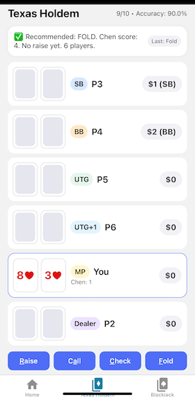

# Flopper — a poker training app

An experiment in building a focused poker training application with Expo + React Native + TypeScript. Runs on the web (PWA) and can run on iOS/Android.

[Play Now!](https://stephenhouser.com/flopper)

Quick links: [TODO.md](./TODO.md) • [NOTES.md](./NOTES.md)

## Features

- Texas Hold'em pre-flop trainer (current)
- Feedback with recommended action and accuracy tracking
- Auto-deal flow with delayed feedback windows
- Session history with PokerStars-like export
- Settings sheet with unified settings and sensible bounds
- Works on Web; optional native key commands for iOS/Android dev builds

Planned

- Texas Hold'em post-flop training
- Omaha pre-flop training
- Blackjack hit/stand/double trainer

## Technology

     

## Getting started

Prereqs: Node.js (LTS), npm, and Expo CLI (installed by scripts).

Install

- npm install

Run

- Web: npm run web
- iOS simulator: npm run ios
- Android emulator: npm run android

Typecheck, lint, test

- Typecheck: npm run typecheck
- Lint: npm run lint
- Tests: npm test (Jest), npm run test:watch

Deploy to GitHub Pages (web)

- npm run predeploy (builds static export)
- npm run deploy (publishes to gh-pages)

## Keyboard shortcuts (pre-flop trainer)

- c — check
- a — call
- f — fold
- r — raise/bet
- space — new hand
- enter — repeat last action

Note: Native key commands require a dev build and the optional react-native-key-command module. See NOTES.md for setup.

## Architecture (short)

- models/poker.ts — centralized domain types (Player, Action, Street, Board), constants, settings
- lib/gameplay.ts — pure gameplay helpers (state machine, deal/settle helpers)
- hooks/useGameEngine.ts — stateful engine (deck, players, pot, board, street) using refs for delayed effects
- hooks/useHoldemTrainer.ts — trainer orchestration, unified settings, session wiring, derived values
- hooks/useSession.ts — session and history management
- hooks/usePersistedState.ts — robust persisted state wrapper
- components/poker/* — UI components (PlayerRow, CommunityCards, SettingsSheet)
- __tests__/* — unit tests for gameplay/engine/state machine

### Design notes

- Board model: { flop, turn, river }
- State machine: STREET_ORDER and HAND_STATE_MACHINE drive street progression; nextStreet applies settings to skip streets
- Refs for pot/players/board/street to avoid stale closures during delayed feedback windows

See [NOTES.md](./NOTES.md) for deeper documentation and diagrams. Roadmap lives in TODO.md.

## Session export

You can export the current session to a PokerStars-like text format from the Settings panel. On Web, this downloads a .txt file; on native, it shows the text (saving coming later).

## Contributing / development

- Keep poker domain types and constants in models/poker.ts
- Prefer pure helpers in lib/ and keep hooks stateful and composable
- Use shared constants (e.g., MIN/MAX players, blind factors) instead of magic numbers
- Add tests for gameplay and engine state transitions when making changes

## Notes

This project has been built iteratively using AI-assisted pair programming. Expect rapid changes and refactors during active development.
